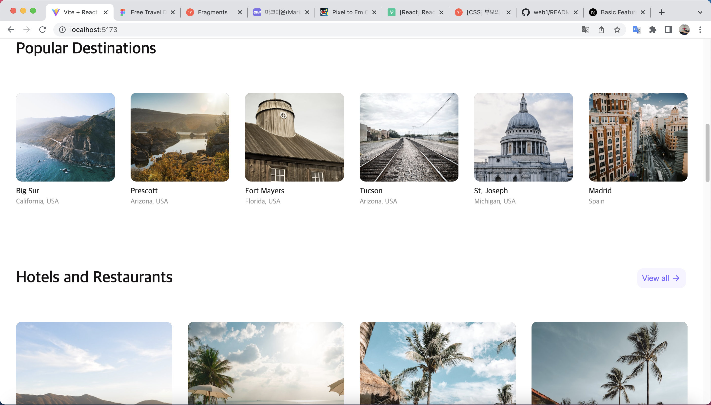

## 사용스택

### 1.Typescript

### 2.Styled-component   

 
 

## 구현 내용

### 1.반응형 웹페이지
#### 작은 사이즈

#### 중간 사이즈

#### 큰 사이즈

 
 

## 참조 figma

### https://www.figma.com/file/E2LFYIiYrPyzM13kiuOr2n/Free-Travel-Design-Template-(Community)?node-id=304-684&t=unTbT9yRRLIVc9yk-0 
